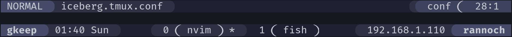
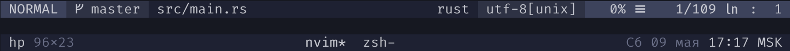
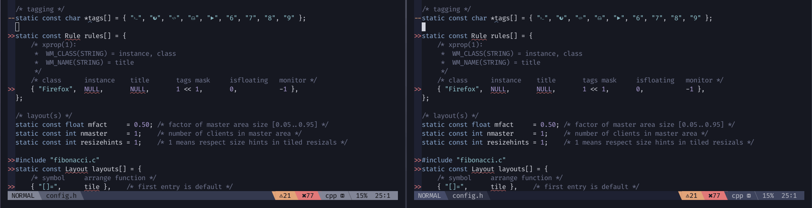
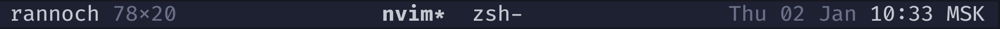

# iceberg-dark
Theme for various programs, designed with love for [iceberg.vim](https://github.com/cocopon/iceberg.vim) theme.

Meant to bring [iceberg.vim](https://github.com/cocopon/iceberg.vim) to other environments and to replace it in places, where original theme is hard to read.


<p style="text-align: center;"><i>Lightline theme with slanted tmux theme</i></p>


<p style="text-align: center;"><i>Airline theme with minimal tmux theme</i></p>

**Requirements**:

* A [Nerd Font](https://github.com/ryanoasis/nerd-fonts/#patched-fonts) (if you don't use one already) for special characters support.

## Currently supported:

### [lightline.vim](https://github.com/itchyny/lightline.vim):

Original iceberg theme: 

iceberg-dark theme: 

Code snippet with both themes side to side: 

**Installation** via [vim-plug](https://github.com/junegunn/vim-plug):

 1. Put `Plug 'gkeep/iceberg-dark'` in your init.vim/.vimrc

 2. Run `:PlugInstall` to **install** the theme.

 3. Put `let g:lightline = { 'colorscheme': 'icebergDark' }` in your init.vim/.vimrc to **enable** the theme.

### [vim-airline](https://github.com/vim-airline/vim-airline):


**Installation** via [vim-plug](https://github.com/junegunn/vim-plug):

 1. Put `Plug 'gkeep/iceberg-dark'` in your init.vim/.vimrc

 2. Run `:PlugInstall` to **install** the theme.

 3. Put `let g:airline_theme='icebergDark'` in your init.vim/.vimrc to **enable** the theme.

### [tmux](https://github.com/tmux/tmux):

#### Minimal

Inspired by [this](https://www.reddit.com/r/unixporn/comments/e6x7lz/dwm_blue_stripes/) post at [r/unixporn](https://www.reddit.com/r/unixporn).



Installation:

1. To download, run the following command:
```
wget -O $HOME/.tmux/iceberg_minimal.tmux.conf \
https://raw.githubusercontent.com/gkeep/iceberg-dark/master/.tmux/iceberg_minimal.tmux.conf
```

2. Add `source-file ~/.tmux/iceberg_minimal.tmux.conf` to your `~/.tmux.conf`

#### With slants

Made with the help of [tmuxline.vim](https://github.com/edkolev/tmuxline.vim)!


Installation:

1. To download, run the following command:
```
wget -O $HOME/.tmux/iceberg.tmux.conf \
https://raw.githubusercontent.com/gkeep/iceberg-dark/master/.tmux/iceberg.tmux.conf
```

2. Add `source-file ~/.tmux/iceberg.tmux.conf` to your `~/.tmux.conf`

### [bumblebee-status](https://github.com/tobi-wan-kenobi/bumblebee-status):


Installation is not required, available at [bumblebee-status repository](https://github.com/tobi-wan-kenobi/bumblebee-status).

Source code available at the root of this repository.

## License

MIT license. See [LICENSE](https://github.com/gkeep/iceberg-dark/blob/master/LICENSE) for more information.
